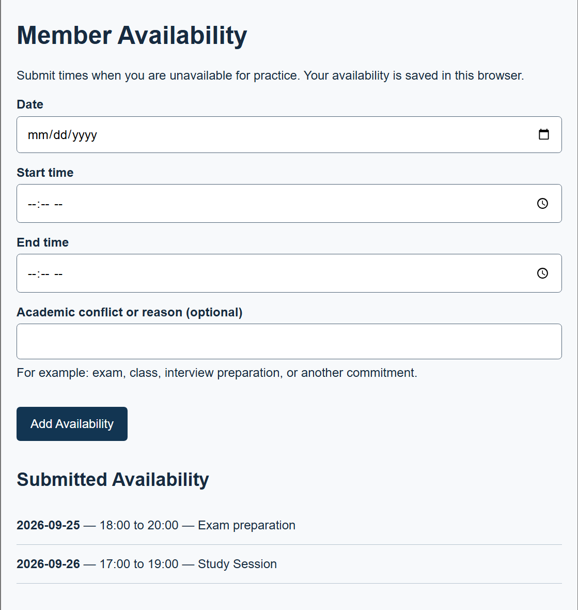
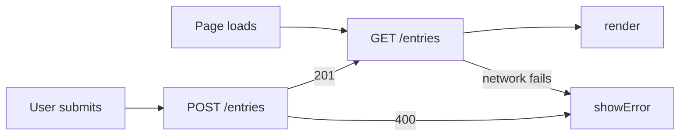

# Competitive Dance Availability: Data Leaves the Browser

## What

Hw3 repository: [mgt3745-hw3](https://github.com/RishiA10/mgt3745-hw3)

This project helps competitive dance team members communicate when academic responsibilities make them unavailable for pratice. The current feature allows a member to submit a date, start time, end time, and optional academic-conflict reason and view the submitted availability. The project context is documented in [PROJECT.md](context/PROJECT.md), and the requirements and acceptance statements are documented in [FEATURES.md](context/FEATURES.md).

In HW3, availability was stored only in browser localStorage. In HW4, entries leave the browser through a Cloudflare worker and are stoed in Cloudflare D1 so persistence is not tied to one browser's local storage. This architecture decision is documented in [ADR-002](context/ARCHITECTURE.md#adr-002-entries-move-from-localstorage-to-cloudflare-d1).

## See It Work

*A GIF or screenshot in `/docs` showing an entry surviving a cleared cache
or appearing in a second browser. Evidence and storefront at once.*

The page loads previously saved availability from the deployed Worker and D1 database. The entries shown below reamined available after restarting the page, and the same records were retrieved separately through the Worker API.

## How to Run

Deployed Worker: `https://mgt3745-hw4.rishia10.workers.dev/entries`

From a fresh Codespace:

1. Open the repository in a Codespace and run `npm install`.
2. Run `npx wrangler login --device` and authorize Cloudflare.
3. Create/configure the D1 database if needed, apply `schema.sql`, and make sure the D1 binding in `wrangler.toml` is named `DB`.
4. Run `npx wrangler deploy` to deploy the Worker.
5. Start the webpage with `python3 -m http.server 8000` and open the forwarded port 8000 URL.

The frontend in `app.js` sends GET and POST requests to the deployed Worker. To run the Worker locally instead, use `npm run dev`.

## Status

| Feature | EARS statement | Verdict |
|---|---|---|
| Save and display availability | When a member submits unavailable times, the system shall save and display the submitted availability. | PASS |
| Reject missing information | If a member submits an availability entry with missing required information, then the system shall reject it and say why. | PASS |
| Survive cleared cache | Stored entries should remain available independently of browser localStorage. | CANNOT TEST YET |
| Server unreachable | If the server is unreachable, the page should visibly report the failure. | CANNOT TEST YET |
| Server returns 500 | If the server fails, the Worker should return a readable server error. | CANNOT TEST YET |
| Second client reads the same table | A separate client should be able to retrieve entries stored through the application. | PASS |

*Full verification table lives in [FEATURES.md](context/FEATURES.md).*

## Links

Reading order for a stranger: [PROJECT.md](context/PROJECT.md) →
[USERS.md](context/USERS.md) → [FEATURES.md](context/FEATURES.md) →
[ARCHITECTURE.md](context/ARCHITECTURE.md) → [STANDARDS.md](context/STANDARDS.md) →
[TOOLS.md](context/TOOLS.md) → [STYLE.md](context/STYLE.md) →
[CLAUDE.md](context/CLAUDE.md)

## AI Use

I used ChatGPT as a guide throughout the assignment to help me organize my thoughts, understand the required steps, and troubleshoot problems as I worked. I made changes to the repository myself instead of copying AI-generated code directly into the project. I used AI to help me understand how the browser, Cloudflare Worker, and D1 database should connect and guide me through setup, deployment, and testing. I spent 10 hours on this assignment.